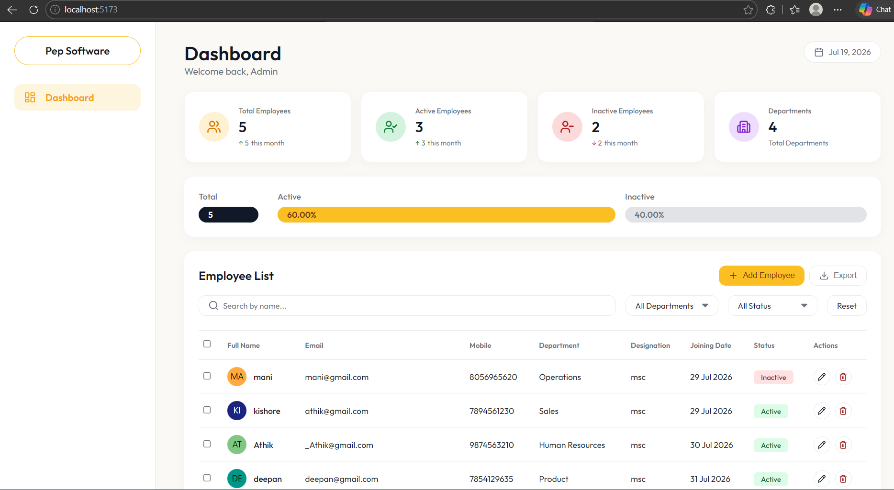
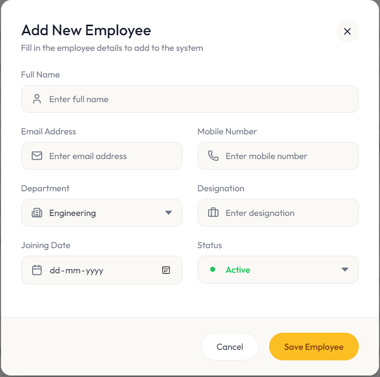

# Employee Management System

## Project Overview
The Employee Management System is a full-stack web application designed to efficiently manage employee records. It provides an intuitive dashboard for HR and administrators to view statistics, track employee status, and perform comprehensive CRUD (Create, Read, Update, Delete) operations. The system includes robust real-time validation, dynamic filtering, and data export capabilities.

## Screenshots

### Dashboard


### Add/Edit Employee Form


## Tech Stack
**Frontend:**
- React 19
- Vite
- React Router DOM
- Axios
- Lucide React (Icons)
- CSS3 (Custom styling)

**Backend:**
- Node.js
- Express
- MySQL2 (Database)
- Cors

## Features
- **Comprehensive Dashboard**: View total, active, and inactive employees, alongside dynamic monthly trends and progress bars.
- **Employee CRUD**: Seamlessly add, edit, and delete employee records.
- **Strict Real-Time Validation**: 
  - Full Name: Instantly blocks numbers and special characters.
  - Email: Auto-lowercased, strictly enforces valid patterns.
  - Mobile Number: Limited to exactly 10 digits starting with 6-9.
- **Duplicate Prevention**: Backend uniqueness checks strictly prevent registering duplicate emails and mobile numbers, returning field-specific UI alerts.
- **Advanced Filtering**: Filter records by employee name, department, or status instantly.
- **Export to CSV**: Download the current view of the employee table directly to a CSV file.

## Folder Structure
```text
d:/Pep_Software/employee-management-system/
│
├── backend/                  # Node.js + Express Backend
│   ├── src/
│   │   ├── config/           # Database configuration (db.js)
│   │   ├── constants/        # Application constants and Status Codes
│   │   ├── controllers/      # Route controllers (employeeController.js)
│   │   ├── models/           # MySQL Database operations (employeeModel.js)
│   │   └── routes/           # Express API routing (employeeRoutes.js)
│   ├── server.js             # Main server entry point
│   └── package.json
│
└── frontend/                 # React + Vite Frontend
    ├── src/
    │   ├── components/       # Reusable UI components (Modals, Tables, Cards)
    │   ├── pages/            # Main page views (Home.jsx)
    │   ├── services/         # Axios API configuration (api.js)
    │   ├── utils/            # Shared constants (constants.js)
    │   ├── App.jsx           # Root React component
    │   ├── index.css         # Global styling
    │   └── main.jsx          # React DOM mounting
    ├── index.html            # Vite HTML template
    └── package.json
```

## Setup Instructions

### Prerequisites
- Node.js (v18+)
- MySQL (v8.0+)

### Database Setup
1. Ensure your local MySQL server is running on port `3307`.
2. The application is configured to automatically create the `pep_software` database and the `employees` table on startup. Ensure the user `root` with password `1234` exists, or adjust `backend/src/config/db.js` to match your MySQL credentials.

### Backend Setup
1. Open a terminal and navigate to the backend directory: `cd backend`
2. Install dependencies: `npm install`
3. Start the server: `npm start` or `npm run dev`
   - The API will be available at `http://localhost:5000`

### Frontend Setup
1. Open a new terminal and navigate to the frontend directory: `cd frontend`
2. Install dependencies: `npm install`
3. Start the Vite development server: `npm run dev`
   - The application will be available at `http://localhost:5173`

### Git Ignored Files (For New Developers)
When cloning this repository, certain files are intentionally ignored by Git (`.gitignore`) and will not be present. You must generate them locally:
- **`node_modules/`**: Contains all external dependencies. You must run `npm install` in both the `frontend/` and `backend/` directories to generate these.
- **`.env` files**: Used for storing sensitive environment variables and secrets. In the future, you will need to create a `.env` file locally to store your own database credentials and API keys.
- **`dist/` & `logs`**: Build outputs and error logs are kept locally to your machine and are never pushed to the central repository.

## API Documentation

The backend exposes a RESTful API hosted at `/api/employees`.

| Method | Endpoint | Description | Query/Body |
|--------|----------|-------------|------------|
| `GET`  | `/api/employees` | Get all employees | `?name=&department=&status=` |
| `GET`  | `/api/employees/stats` | Get dashboard statistics | None |
| `GET`  | `/api/employees/:id` | Get single employee | URL Param: `id` |
| `POST` | `/api/employees` | Create a new employee | JSON body matching employee schema |
| `PUT`  | `/api/employees/:id` | Update existing employee | JSON body matching employee schema |
| `DELETE`| `/api/employees/:id` | Delete an employee | URL Param: `id` |

## Development Flow
1. **Component Design**: UI components were built prioritizing reusability (e.g., Modals, Data Tables, Dashboard Cards).
2. **Form Management**: Employee modifications happen via a centralized Modal using React state to manage dynamic input, strict regex patterns, and asynchronous API calls.
3. **Backend Integration**: The Express server acts as a bridge to MySQL using the `mysql2` connection pool, ensuring queries are robust, parameterized, and secure against SQL injection.
4. **Validation Pipeline**: Validation operates on two layers:
   - Frontend: Instantly shapes input (e.g., auto-lowercasing, blocking numbers) and validates against regex.
   - Backend: Re-verifies structural integrity and performs asynchronous uniqueness checks against the database.

## Application Flow
1. **Initialization**: On initial render, the frontend fetches both employee data and dashboard statistics concurrently.
2. **Dashboard Rendering**: 
   - Cards display total counts and monthly trends.
   - The table renders the employee dataset.
3. **Filtering**: Utilizing the top filter bar updates React state, triggering an automatic, debounced API request to fetch filtered data.
4. **Modifications**: Adding or editing an employee opens the modal. Upon successful submission (and backend validation), the modal closes and the dashboard automatically re-fetches the latest data to reflect changes.
5. **Exporting**: Clicking "Export" transforms the locally filtered dataset directly into a dynamically generated CSV file on the client-side.

## Assumptions
- MySQL Server runs on localhost port `3307` (rather than the default `3306`).
- The database user is `root` with the password `1234`.
- Node.js API runs precisely on port `5000`, and Vite runs on port `5173`.
- The database schema handles timestamps (`createdAt`, `updatedAt`) automatically.
